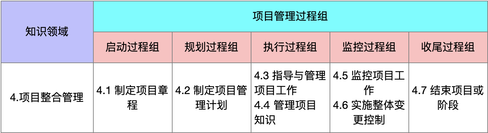
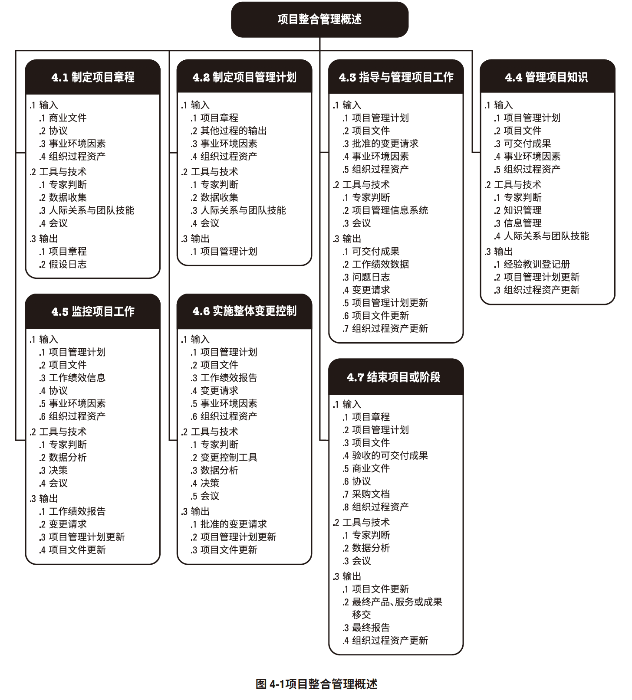
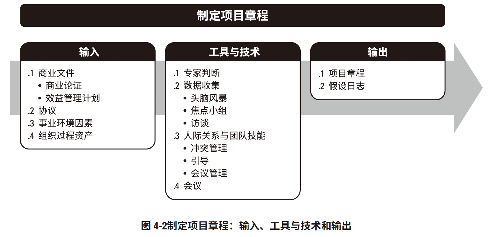
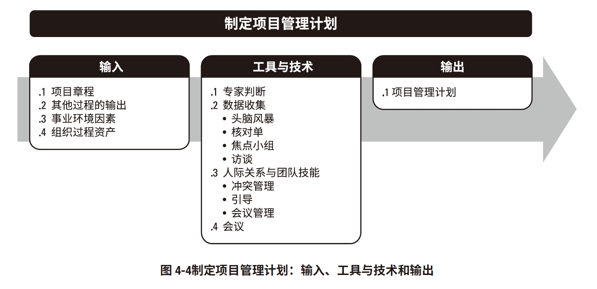
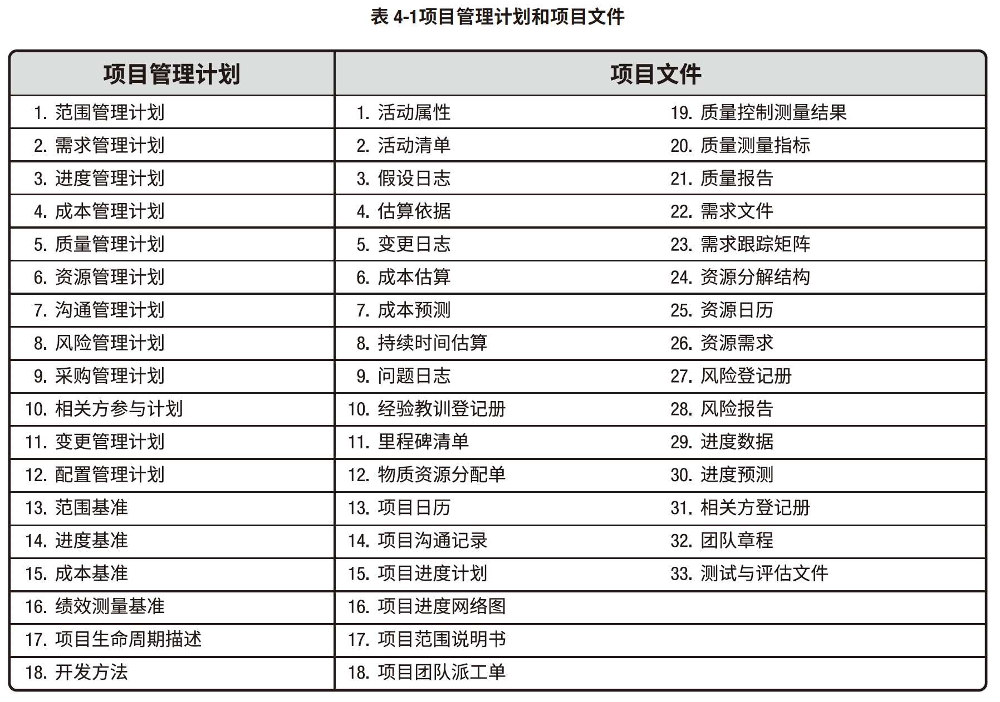
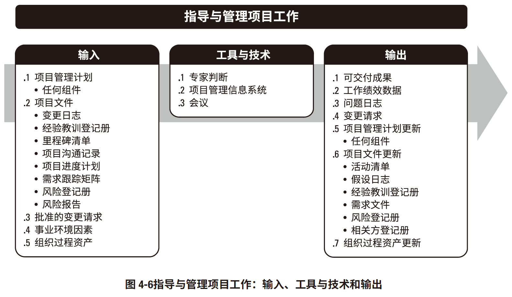

### 项目整合管理

[TOC]

项目整合管理包括对隶属于项目管理过程组的各种过程和项目管理活动进行识别、定义、组合、统一和协调的各个过程。

项目整合管理过程包括：

**4.1 制定项目章程** — 编写一份正式批准项目并授权项目经理在项目活动中使用组织资源的文件的过程。

**4.2 制定项目管理计划** — 定义、准备和协调项目计划的所有组成部分，并把它们整合为一份综合项目管理计划的过程。

**4.3 指导与管理项目工作** — 为实现项目目标而领导和执行项目管理计划中所确定的工作，并实施已批准变更的过程。

**4.4 管理项目知识** — 使用现有知识并生成新知识，以实现项目目标，并且帮助组织学习的过程。

**4.5 监控项目工作** — 跟踪、审查和报告整体项目进展，以实现项目管理计划中确定的绩效目标的过程。

**4.6 实施整体变更控制** — 审查所有变更请求，批准变更，管理对可交付成果、组织过程资产、项目文件和项目管理计划的变更，并对变更处理结果进行沟通的过程。

**4.7 结束项目或阶段** — 终结项目、阶段或合同的所有活动的过程。

图 4-1 概述了项目整合管理的各个过程。

## 项目整合管理的核心概念

**项目整合管理由项目经理负责，该责任不能被授权或转移**。只能由项目经理负责整合所有其他知识领域的成果，并掌握项目总体情况。**项目经理必须对整个项目承担最终责任。**

项目与项目管理本质上具有整合性质，例如，为应急计划制定成本估算时，就需要整合项目成本管理、项目进度管理和项目风险管理知识领域中的相关过程。在识别出与各种人员配备方案有关的额外风险时，可能需要再次进行上述某个或某几个过程。项目管理过程组的各个过程之间经常反复发生联系。例如，在项目早期，规划过程组为执行过程组提供书面的项目管理计划；然后，随着项目的进展，规划过程组还将根据变更情况，更新项目管理计划。

## 4.1 制定项目章程

**定义：**编写一份**正式批准项目**并**授权项目经理在项目活动中使用组织资源**的文件的过程。

**作用：**明确项目与组织战略目标之间的直接联系，确立项目的正式地位，并展示组织对项目的承诺。

**开展时间：**仅开展一次或仅在项目的预定义点开展**。

图 4-2 描述本过程的输入、工具与技术和输出。

项目章程在项目执行组织与需求组织之间建立起伙伴关系。**项目章程一旦被批准，就标志着项目的正式启动**。在项目中，应尽早确认并任命项目经理，最好在制定项目章程时就任命，且总应在规划开始之前任命。**项目章程授权项目经理规划、执行和控制项目。**

**项目由项目以外的机构来启动**，如发起人、项目集或项目管理办公室（PMO）、项目组合治理委员会主席或其授权代表。**项目启动者或发起人应该具有一定的职权，能为项目获取资金并提供资源**。

项目可能因内部经营需要或外部影响而启动，故通常需要编制需求分析、可行性研究、商业论证或有待项目处理的情况的描述。**通过编制项目章程，来确认项目符合组织战略和日常运营的需要**。**不要把项目章程看作合同**，因为其中未承诺报酬或金钱或用于交换的对价。

### 4.1.1 制定项目章程：输入

- #### 商业文件

  主要是商业论证和效益管理计划

- #### 协议

  协议有多种形式，包括合同、谅解备忘录（MOUs）、服务水平协议（SLA）、协议书、意向书、口头协议、电子邮件或其他书面协议。

- #### 事业环境因素

  -  政府或行业标准（如产品标准、质量标准、安全标准和工艺标准）；
  - 法律法规要求和（或）制约因素；
  - 市场条件；
  - 组织文化和政治氛围；
  - 组织治理框架（通过安排人员、制定政策和确定过程，以结构化的方式实施控制、指导和协调，以实现组织的战略和运营目标）；
  - 相关方的期望和风险临界值。

- #### 组织过程资产

  - 组织的标准政策、流程和程序；
  - 项目组合、项目集和项目的治理框架（用于提供指导和制定决策的治理职能和过程）；
  - 监督和报告方法；
  - 模板（如项目章程模板）；
  - 历史信息与经验教训知识库（如项目记录与文件、关于以往项目选择决策的结果及以往项目绩效的信息）。

### 4.1.2 制定项目章程：工具与技术

#### 4.1.2.1 专家判断

专家判断是指基于某应用领域、知识领域、学科和行业等的专业知识而做出的，关于当前活动的合理判断，这些专业知识可来自具有专业学历、知识、技能、经验或培训经历的任何小组或个人。

本过程应该就以下主题，考虑具备相关专业知识或接受过相关培训的个人或小组的意见：

- 组织战略；
- 效益管理；
- 关于项目所在的行业以及项目关注的领域的技术知识；
- 持续时间和预算的估算；
- 风险识别。

#### 4.1.2.2 数据收集

可用于本过程的数据收集技术包括（但不限于）：

- **头脑风暴**。本技术用于在短时间内获得大量创意，**适用于团队环境，需要引导者进行引导**。头脑风暴由两个部分构成：**创意产生和创意分析**。制定项目章程时可通过头脑风暴向相关方、主题专家和团队成员收集数据、解决方案或创意。
- **焦点小组。**焦点小组是**召集预定的相关方和主题专家**，**了解他们对所讨论的产品、服务或成果的期望和态度。由一位受过训练的主持人引导大家进行互动式讨论**。焦点小组往往比“一对一”的访谈更热烈。
- **访谈。**访谈是通过**与相关方直接交谈**，来获取信息的**正式或非正式**的方法。访谈的典型做法是向被访者提出预设和即兴的问题，并记录他们的回答。访谈经常是一个访谈者和一个被访者之间的“一对一”谈话，但也可以包括多个访谈者和/或多个被访者。**访谈有经验的项目参与者、发起人和其他高管，以及主题专家**，有助于识别和定义所需产品可交付成果的特征和功能。访谈也可用于获取机密信息。

#### 4.1.2.3 人际关系与团队技能

可用于本过程的人际关系与团队技能包括（但不限于）：

- **冲突管理。**冲突的来源包括**资源稀缺**、**进度优先级排序**和**个人工作风格差异**等。采用团队基本规则、团队规范及成熟的项目管理实践（如沟通规划和角色定义），可以减少冲突的数量。

  成功的冲突管理可提高生产力，改进工作关系。同时，如果管理得当，**意见分歧有利于提高创造力和改进决策**。**假如意见分歧成为负面因素，应该首先由项目团队成员负责解决**；如果**冲突升级，项目经理应提供协助**，促成满意的解决方案，**采用直接和合作的方式，尽早并且通常在私下处理冲突**。**如果破坏性冲突继续存在**，**则可使用正式程序，包括采取惩戒措施。**

  有五种常用的冲突解决方法，每种技巧都有各自的作用和用途。

  - **撤退/回避。**从实际或潜在冲突中退出，将问题推迟到准备充分的时候，或者将问题推给其他人员解决
  - **缓和/包容。**强调一致而非差异；为维持和谐与关系而退让一步，考虑其他方的需要。
  - **妥协/调解。**为了暂时或部分解决冲突，寻找能让各方都在一定程度上满意的方案，但这种方法有时会导致“双输”局面。
  - **强迫/命令。**以牺牲其他方为代价，推行某一方的观点；**只提供赢 — 输方案**。通常是利用权力来强行解决紧急问题，这种方法通常会导致“赢输”局面。
  - **合作/解决问题**。综合考虑不同的观点和意见，采用合作的态度和开放式对话引导各方达成共识和承诺，这种方法可以带来双赢局面。

- **引导。**引导是指有效引导团队活动成功以达成决定、解决方案或结论的能力。引导者确保参与者有效参与，互相理解，考虑所有意见，按既定决策流程全力支持得到的结论或结果，以及所达成的行动计划和协议在之后得到合理执行。

- **会议管理。**见 10.2.2.6 节。会议管理包括准备议程、确保邀请每个关键相关方群体的代表，以及准备和发送后续的会议纪要和行动计划。

#### 4.1.2.4 会议

在本过程中，与关键相关方举行会议的目的是识别项目目标、成功标准、主要可交付成果、高层级需求、总体里程碑和其他概述信息。

### 4.1.3 制定项目章程：输出

#### 4.1.3.1 项目章程

项目章程是由**项目启动者或发起人**发布的，正式**批准项目成立**，并**授权项目经理使用组织资源开展项目活动**的文件。它记录了关于项目和项目预期交付的产品、服务或成果的高层级信息，例如：

- 项目目的；
- 可测量的项目目标和相关的成功标准；
- 高层级需求；
- 高层级项目描述、边界定义以及主要可交付成果；
- 整体项目风险；
- 总体里程碑进度计划；
- 预先批准的财务资源；
- 关键相关方名单；
- 项目审批要求（例如，用什么标准评价项目成功，由谁对项目成功下结论，由谁来签署项目

结束）；

- 项目退出标准（例如，在何种条件下才能关闭或取消项目或阶段）；
- 委派的项目经理及其职责和职权；
- 发起人或其他批准项目章程的人员的姓名和职权。
- 项目章程确保相关方在总体上就主要可交付成果、里程碑以及每个项目参与者的角色和职责达

成共识。

- #### 4.1.3.2 假设日志

**假设日志用于记录整个项目生命周期中的所有假设条件和制约因素**。

- **制约因素：**对项目或过程的执行**有影响的限制性因素**，**是确定的、客观存在的**，比如合同的相关要求、一些强制性的里程碑等等。
- **假设条件：**在制定计划时，不需验证即可视为正确、真实或确定的因素，**是当前不能确定的**。同时还应描述如果这些因素不成立，可能造成的潜在影响。

制约因素和假设条件**都存在于项目范围说明书中**，并**作为范围基准的一部分**，是定义活动、估算活动持续时间、制定进度计划、估算成本、制定预算、识别风险和规划采购管理等多个过程的输入。

## 4.2 制定项目管理计划

**定义：**定义、准备和协调项目计划的所有组成部分，并把它们整合为一份综合项目管理计划的过程。

**作用：**生成一份综合文件，用于确定所有项目工作的基础及其执行方式，

**开展时间：**仅开展一次或仅在项目的预定义点开展。图 4-4 描述本过程的输入、工具与技术和输出。

项目管理计划**确定项目的执行、监控和收尾**方式，其内容会因项目所在的应用领域和复杂程度而异。

项目管理计划可以是**概括或详细的**，而每个组成部分的详细程度取决于具体项目的要求。项目管理计划应足够强大，可以应对不断变化的项目环境。这种敏捷性有利于随项目进展产出更准确的信息。

项目管理计划**应基准化**，即，至少应规定项目的**范围、时间和成本**方面的基准，以便据此考核项目执行情况和管理项目绩效。**在确定基准之前，可能要对项目管理计划进行多次更新，且这些更新无需遵循正式流程**。但是，**一旦确定了基准，就只能通过实施整体变更控制过程进行更新**。在这种情况下，如果需要进行变更，应提出变更请求以待决定。这一过程将形成一份项目管理计划。**在项目收尾之前，该计划需要通过不断更新来渐进明细，并且这些更新需要得到控制和批准。**

对隶属于项目集或项目组合的项目，则应该制定与项目集或项目组合管理计划相一致的项目管理计划。例如，项目集管理计划中要求超过某一特定成本的所有变更都需要上报变更控制委员会（CCB）审查，在项目管理计划中就应该对审查流程和成本临界值做出相应规定。

### 4.2.1 制定项目管理计划：输入

#### 4.2.1.1 项目章程

见 4.1.3.1 节。项目团队把项目章程作为初始项目规划的起始点。项目章程所包含的信息种类数量因项目的复杂程度和已知的信息而异。在项目章程中至少应该定义项目的高层级信息，供将来在项目管理计划的各个组成部分中进一步细化。

#### 4.2.1.2 其他过程的输出

创建项目管理计划需要整合诸多过程（如第 5 章至第 13 章所述）的输出。其他规划过程所输出的子计划和基准都是本过程的输入。此外，对这些子计划和基准的变更都可能导致对项目管理计划的相应更新。

#### 4.2.1.3 事业环境因素

- 政府或行业标准（如产品标准、质量标准、安全标准和工艺标准）；

- 法律法规要求和（或）制约因素；

- 垂直市场（如建筑）和（或）专门领域（如环境、安全、风险或敏捷软件开发）的项目管理知识体系；

- 组织的结构、文化、管理实践和可持续性；

- 组织治理框架（通过安排人员、制定政策和确定过程，以结构化的方式实施控制、指导和协调，以实现组织的战略和运营目标）；

- 基础设施（如现有的设施和固定资产）。

#### 4.2.1.4 组织过程资产

- 组织的标准政策、流程和程序；

- 项目管理计划模板，包括：
  - 根据项目的特定要求而裁剪组织的标准流程的指南和标准；
  - 项目收尾指南或要求，如产品确认及验收标准。

- 变更控制程序，包括修改正式的组织标准、政策、计划、程序或项目文件，以及批准和确认变更所须遵循的步骤；

- 监督和报告方法、风险控制程序，以及沟通要求；

- 以往类似项目的相关信息（如范围、成本、进度与绩效测量基准、项目日历、项目进度网络图和风险登记册）；

- 历史信息和经验教训知识库。

### 4.2.2 制定项目管理计划：工具与技术

#### 4.2.2.1 专家判断

#### 4.2.2.2 数据收集

可用于本过程的数据收集技术包括（但不限于）：

- **头脑风暴。**见 4.1.2.2 节。制定项目管理计划时，经常以头脑风暴的形式来收集关于项目方法的创意和解决方案。参会者包括项目团队成员，其他主题专家 (SME) 或相关方也可以参与。

- **核对单。**见 11.2.2.2 节。很多组织基于自身经验制定了标准化的核对单，或者采用所在行业的核对单。核对单可以指导项目经理制定计划或帮助检查项目管理计划是否包含所需全部信息。

- **焦点小组。**见 5.2.2.2 节。焦点小组召集相关方讨论项目管理方法以及项目管理计划各个组成部分的整合方式。

- **访谈。**见 5.2.2.2 节。访谈用于从相关方获取特定信息，用以制定项目管理计划、任何子计划或项目文件。

#### 4.2.2.3 人际关系与团队技能

制定项目管理计划时需要的人际关系与团队技能包括：

- **冲突管理。**同上

- **引导**。

- **会议管理。**见 10.2.2.6 节。有必要采用会议管理来确保有效召开多次会议，以便制定、统一和商定项目管理计划。

#### 4.2.2.4 会议

项目**开工会议通常意味着规划阶段结束和执行阶段开始**，旨在传达项目目标、获得团队对项目的承诺，以及阐明每个相关方的角色和职责。开工会议可能在不同时间点举行，具体取决于项目的特征：

- **对于小型项目**，通常由同一个团队开展项目规划和执行。这种情况下，项目在启动之后很快就会开工（规划过程组），因为执行团队参与了规划。

- **对于大型项目**，通常由项目管理团队开展大部分规划工作。在初始规划工作完成、开发（执行）阶段开始时，项目团队其他成员才参与进来。这种情况下，将随同执行过程组的相关过程召开开工会议。

**对于多阶段项目，通常在每个阶段开始时都要 举行一次开工会议。**

### 4.2.3 制定项目管理计划：输出

#### 4.2.3.1 项目管理计划

项目管理计划是说明项目执行、监控和收尾方式的一份文件，它整合并综合了所有**子管理计划**和**基准**，以及管理项目所需的其他信息。

项目管理计划组件包括（但不限于）：

- 子管理计划：
  - 范围管理计划。见 5.1.3.1 节。确立如何定义、制定、监督、控制和确认项目范围。
  - 需求管理计划。见 5.1.3.2 节。确定如何分析、记录和管理需求。
  - 进度管理计划。见 6.1.3.1 节。为编制、监督和控制项目进度建立准则并确定活动。
  - 成本管理计划。见 7.1.3.1 节。确定如何规划、安排和控制成本。
  - 质量管理计划。见 8.1.3.1 节。确定在项目中如何实施组织的质量政策、方法和标准。
  - 资源管理计划。见 9.1.3.1 节。指导如何对项目资源进行分类、分配、管理和释放。
  - 沟通管理计划。见 10.1.3.1 节。确定项目信息将如何、何时、由谁来进行管理和传播。
  - 风险管理计划。见 11.1.3.1 节。确定如何安排与实施风险管理活动。
  - 采购管理计划。见 12.1.3.1 节。确定项目团队将如何从执行组织外部获取货物和服务。
  - 相关方参与计划。见 13.2.3.1 节。确定如何根据相关方的需求、利益和影响让他们参与项目决策和执行。

- 基准：
  - 范围基准。见 5.4.3.1 节。经过批准的范围说明书、工作分解结构 (WBS) 和相应的 WBS 词典，用作比较依据。
  - 进度基准。见 6.5.3.1 节。经过批准的进度模型，用作与实际结果进行比较的依据。
  - 成本基准。见 7.3.3.1 节。经过批准的、按时间段分配的项目预算，用作与实际结果进行比较的依据。

-  其他组件。虽然在本过程生成的组件会因项目而异，但是通常包括（但不限于）：
  - 变更管理计划。描述在整个项目期间如何正式审批和采纳变更请求。
  - 配置管理计划。描述如何记录和更新项目的特定信息，以及该记录和更新哪些信息，以保持产品、服务或成果的一致性和（或）有效性。
  - 绩效测量基准。经过整合的项目范围、进度和成本计划，用作项目执行的比较依据，以测量和管理项目绩效。
  - 项目生命周期。描述项目从开始到结束所经历的一系列阶段。
  - 开发方法。描述产品、服务或成果的开发方法，例如预测、迭代、敏捷或混合型模式。
  - 管理审查。确定项目经理和有关相关方审查项目进展的时间点，以考核绩效是否符合预期，或者确定是否有必要采取预防或纠正措施。

## 4.3 指导与管理项目工作

**定义：**为实现项目目标而领导和执行项目管理计划中所确定的工作，并实施已批准变更的过程。

**作用：**对项目工作和可交付成果开展综合管理，以提高项目成功的可能性。

**开展时间：**需要在整个项目期间开展。图 4-6 描述本过程的输入、工具与技术和输出。

### 4.3.1 指导与管理项目工作：输入

#### 4.3.1.1 项目管理计划

项目管理计划的任何组件都可用作本过程的输入。

#### 4.3.1.2 项目文件

可作为本过程输入的项目文件包括（但不限于）：

- **变更日志。**见 4.6.3.3 节。变更日志记录所有变更请求的状态。

- **经验教训登记册。**见 4.4.3.1 节。经验教训用于改进项目绩效，以免重犯错误。登记册有助于确定针对哪些方面设定规则或指南，以使团队行动保持一致。

- **里程碑清单。**见 6.2.3.3 节。里程碑清单列出特定里程碑的计划实现日期。

- **项目沟通记录。**见 10.2.3.1 节。项目沟通记录包含绩效报告、可交付成果的状态，以及项目生成的其他信息。

- **项目进度计划。**见 6.5.3.2 节。进度计划至少包含**工作活动清单、持续时间、资源**，以及计划的开始与完成日期。

- **需求跟踪矩阵。**见 5.2.3.2 节。需求跟踪矩阵**把产品需求连接到相应的可交付成果**，**有助于把关注点放在最终结果上。**

- **风险登记册。**见 11.2.3.1 节。风险登记册提供可能影响项目执行的各种**威胁和机会**的信息。

- **风险报告。**见 11.2.3.2 节。风险报告**提供关于整体项目风险来源的信息**，以及关于已识别单个项目风险的概括信息。

### 4.3.1.3 批准的变更请求

见 4.6.3.1 节。**批准的变更请求是实施整体变更控制过程的输出**，包括经项目经理审查和批准的变更请求，必要时可经变更控制委员会 (CCB) 审查和批准。批准的变更请求可能是**纠正措施、预防措施或缺陷补救**，并由项目团队纳入项目进度计划付诸实施，可能对项目或项目管理计划的任一领域产生影响，还可能导致修改正式受控的项目管理计划组件或项目文件。

#### 4.3.1.4 事业环境因素

#### 4.3.1.5 组织过程资产

### 4.3.2 指导与管理项目工作：工具与技术

#### 4.3.2.1 专家判断

见 4.1.2.1 节。应该就以下主题，考虑具备相关专业知识或接受过相关培训的个人或小组的意见：

- 关于项目所在的行业以及项目关注的领域的技术知识；

- 成本和预算管理；

- 法规与采购；

- 法律法规；

- 组织治理。

#### 4.3.2.2 项目管理信息系统 (PMIS)

PMIS 提供信息技术 (IT) 软件工具，例如进度计划软件工具、工作授权系统、配置管理系统、信息收 集与发布系统，以及进入其他在线自动化系统（如公司知识库）的界面。自动收集和报告关键绩效 指标（KPI）可以是本系统的一项功能。

#### 4.3.2.3 会议

在指导与管理项目工作时，可以通过会议来讨论和解决项目的相关事项。参会者可包括项目经 理、项目团队成员，以及与所讨论事项相关或会受该事项影响的相关方。应该明确每个参会者的角 色，确保有效参会。会议类型包括（但不限于）：开工会议、技术会议、敏捷或迭代规划会议、每 日站会、指导小组会议、问题解决会议、进展跟进会议以及回顾会议。

#### 4.3.3 指导与管理项目工作：输出

#### 4.3.3.1 可交付成果

**可交付成果是在某一过程、阶段或项目完成时，必须产出的任何独特并可核实的产品、成果或服务能力**。它通常是项目结果，并可包括项目管理计划的组成部分。

**一旦完成了可交付成果的第一个版本，就应该执行变更控制**。用配置管理工具和程序来支持对可 交付成果（如文件、软件和构件）的多个版本的控制。

#### 4.3.3.2 工作绩效数据

工作绩效数据是在执行项目工作的过程中，从每个正在执行的活动中收集到的原始观察结果和测量值。数据通常是最低层次的细节，将交由其他过程从中提炼出信息。在工作执行过程中收集数 据，再交由控制过程做进一步分析。例如，工作绩效数据包括已完成的工作、关键绩效指标 (KPI)、技术绩效测量结果、进度活动的实 际开始日期和完成日期、已完成的故事点、可交付成果状态、进度进展情况、变更请求的数量、缺陷的数量、实际发生的成本、实际持续时间等。